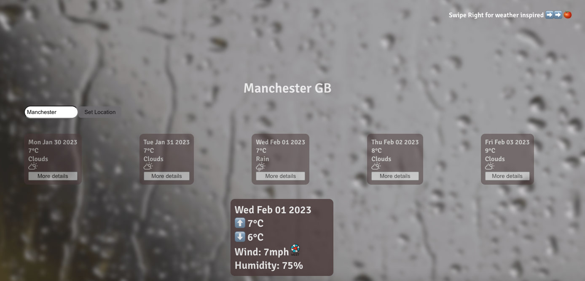
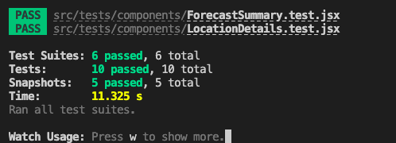

&nbsp;

# &nbsp;&nbsp;&nbsp;&nbsp;&nbsp;&nbsp;&nbsp;&nbsp;&nbsp; Weather App + Pomodoro Tool 🍅

&nbsp;&nbsp;&nbsp;&nbsp;&nbsp;&nbsp;&nbsp;&nbsp;&nbsp;&nbsp;&nbsp;&nbsp;&nbsp;&nbsp;&nbsp;&nbsp;&nbsp;&nbsp;&nbsp;&nbsp;**An exercise on React 🌞 🌧️**

### Objectives

This project is my first encounter with React. A simple weather App that allows you to fetch the upcoming forecast for any city in Great Britain. It will show you a general preview, and you can choose to recieve more detailed information on any specific day. To make it more functional, I added a special feature, but more about 🍅🍅 below!



### Planning & Development

Trough this project I've focussed more in implementing complex components and refactoring the code rather than the design of it. The main objective of the project was to send a GET request to an external API that would feed weather forecast to our app. To achieve this I used the following:

- React Components,
- Axios (To handle the requests to the external API),
- PropTypes (To validate props),
- React Player (To play YouTube videos within the app),
- Weather Icon (To display the interger given by its equivalent weather icon).

### React Player 🍅

Through this process I let the user experience to lead my decisions - reflecting on the components the users would see, interact with and need to improve their journey through the app. I imagined users turning on the app, and how the weather outside would affect their mood - maybe they are trying to get some work done, or are thinking about their weekend plans... 

Something that I like to do to stay focussed in front of the computer through large periods of time is to play Pomodoro YouTube videos that include ambience sound reflecting the weather outside. I introduced this feature where users can also access Pomodoro videos depending on the weather description of the forecast selected.

In order to achieve this I included React Player API into my app, and styled it so it's not present unless the user swipes right.

### Set Up

In order to run this app in your machine follow these steps:

1. Fork this project. Then clone the repo to your machine:

```bash
git clone git@github.com:[your-github-username]/weather-app
```

2. Install the project's dependencies:

```bash
npm install
```

3. To run the app in development mode in your http://localhost:3000 run

```bash
npm start
```

### Test Suites

To test the functionality and components of the app, I used React Test Library - this is the latest test result log:

<details>
<summary>Tests</summary>



</details>

### TODO

I would like to continue to improve the App by:

- Testing more components and more thoroughly,
- Adding animations to the Location text by using React Hooks,
- Implement a button that takes you to the Pomodoro screen (I'd like to give useContext a go),
- General style change to a more modern, simple version.

### Credits

The Pomodoro videos belong to YouTuber ['Abao in Tokio'](https://www.youtube.com/@abaointokyo), who has accompanied me through many study hours.

The gif background images come from [Gifer](https://gifer.com/en/p/tos).


